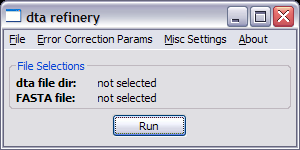
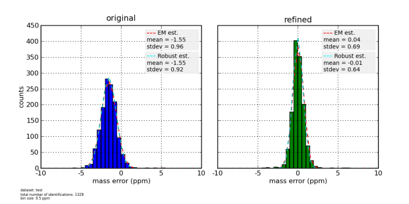
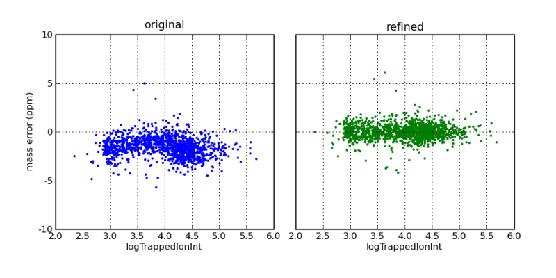
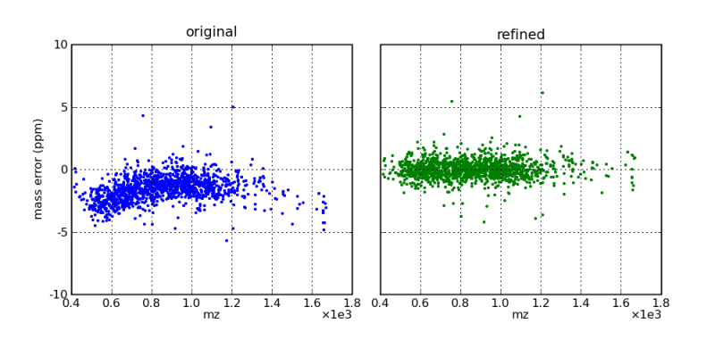
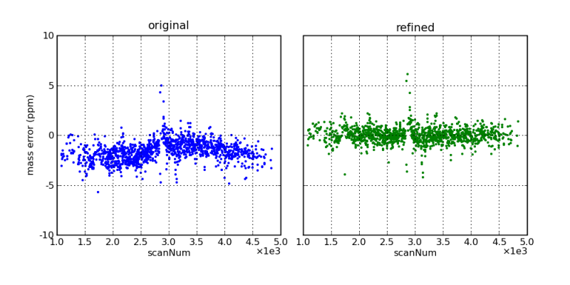

# __DtaRefinery__
Reduces mass measurement errors for parent ions of tandem MS/MS data by modeling systematic errors based on putative peptide identifications. This information is used to subtract out errors from parent ion protonated masses.

### Description
The software reads concatenated dta files, which can be obtained either by concatenating individual dta files from extract_msn output or by running DeconMSn with the -XCDTA option. It is recommended to use DeconMSn as a preprocessing tool since it not only picks the right monoisotopic mass for parent ions, but also provides additional information that can be used for statistical analysis (specifically, ion intensity, total ion current, and AGC accumulation times).

As an output, DtaRefinery produces a concatenated dta file, but with corrected protonated parent ion mass values. Optionally it can output a mass error distribution histogram with the estimates of mean and standard deviation of parent ion mass measurements, along with scatterplots showing original and final dependencies of mass measurement errors on parameters like scan number, m/z, ion intensity and total ion current.

Modeling of the systematic mass measurement error is based on robust non-parametric regression analysis of dependency of error residuals on multiple parameters, including scan number, m/z, ion intensity, and total ion current.

### Related Publications
[DtaRefinery, a software tool for elimination of systematic errors from parent ion mass measurements in tandem mass spectra data sets.](https://pubmed.ncbi.nlm.nih.gov/20019053/)

### Downloads
* [Installer, Version 1.2.0.1](https://github.com/PNNL-Comp-Mass-Spec/DtaRefinery/releases/tag/v1.2.0.1)
* [Source code on GitHub](https://github.com/PNNL-Comp-Mass-Spec/DtaRefinery)

#### Software Instructions
After installing, please see the Readme.txt file or [Online Readme](https://github.com/PNNL-Comp-Mass-Spec/DtaRefinery/blob/master/Readme.md) for additional details on using DtaRefinery. Note that several example data files will be included in the examples folder.

DTARefinery GUI

  
The DtaRefinery user interface allows you to customize the data processing options and process _dta.txt files

Mass Error Histograms  

  
Mass errors, as a function of ion intensity, before and after mass correction by the DtaRefinery application

  
Mass errors, as a function of m/z, before and after mass correction by the DtaRefinery application

  
Mass errors, as a function of scan number (i.e., elution time), before and after mass correction by the DtaRefinery application

### Acknowledgment

All publications that utilize this software should provide appropriate acknowledgement to PNNL and the DtaRefinery GitHub repository. However, if the software is extended or modified, then any subsequent publications should include a more extensive statement, as shown in the Readme file for the given application or on the website that more fully describes the application.

### Disclaimer

These programs are primarily designed to run on Windows machines. Please use them at your own risk. This material was prepared as an account of work sponsored by an agency of the United States Government. Neither the United States Government nor the United States Department of Energy, nor Battelle, nor any of their employees, makes any warranty, express or implied, or assumes any legal liability or responsibility for the accuracy, completeness, or usefulness or any information, apparatus, product, or process disclosed, or represents that its use would not infringe privately owned rights.

Portions of this research were supported by the NIH National Center for Research Resources (Grant RR018522), the W.R. Wiley Environmental Molecular Science Laboratory (a national scientific user facility sponsored by the U.S. Department of Energy's Office of Biological and Environmental Research and located at PNNL), and the National Institute of Allergy and Infectious Diseases (NIH/DHHS through interagency agreement Y1-AI-4894-01). PNNL is operated by Battelle Memorial Institute for the U.S. Department of Energy under contract DE-AC05-76RL0 1830.

We would like your feedback about the usefulness of the tools and information provided by the Resource. Your suggestions on how to increase their value to you will be appreciated. Please e-mail any comments to proteomics@pnl.gov
